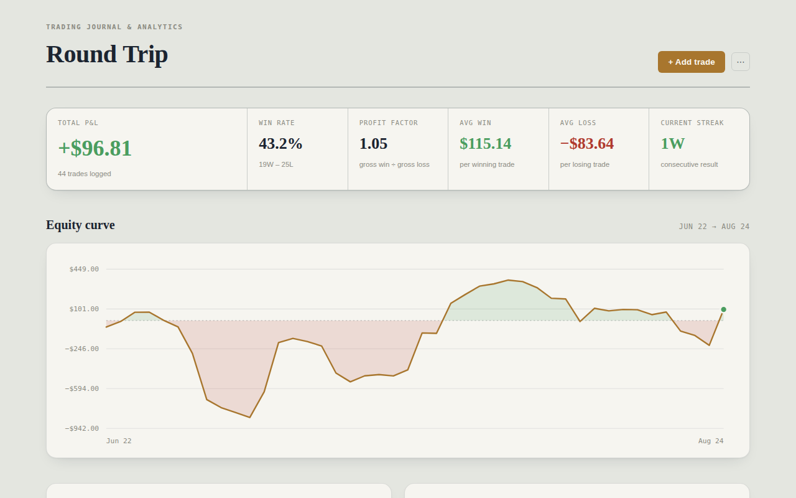

# Round Trip

A private trading journal and analytics tool — win rate, profit factor, equity curve, and which of your strategies are actually making money. One HTML file, no backend, no signup.

https://v12eap.github.io/round-trip/

## Features

- **Trade logging** — long/short, entry/exit, fees, strategy tags, notes, with a live P&L preview as you type
- **Equity curve** — cumulative P&L over time, shaded green above breakeven and red through drawdowns
- **Daily P&L heatmap** — a 13-week calendar showing which days made or lost money
- **Edge by strategy** — net P&L grouped by tag, so you can see which setups are actually working
- **Sortable, filterable trade log** — search, filter by side/strategy/date range
- **CSV import & export** — bring in existing trade history, back up what's here
- **Built-in guide** — a full walkthrough is one click away in the app itself

## Getting started

There's nothing to install or build. Open `index.html` in a browser and it works.

To put it on a free, permanent web address instead of running it locally, turn on **GitHub Pages** for this repo: **Settings → Pages → Source: Deploy from a branch → main / (root) → Save**.

## How your data works

Every trade is saved to your browser's local storage — nothing is sent to a server, and nobody but you can see it. That also means it's per-browser and per-device: export a CSV now and then if you want a backup, or if you want to move your history somewhere else.

## Built with

Plain HTML, CSS, and JavaScript. No frameworks, no dependencies, no build step.
